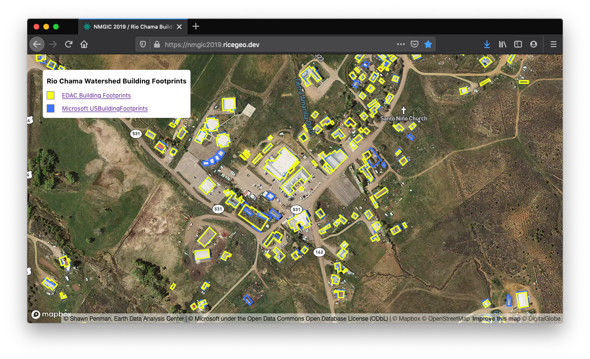

🌵The [NMGIC](https://nmgic.com) Fall conference theme was Programming and App
Development. My talk was titled _Visualizing Open Data: Serverless single page
web app development using Mapbox, Netlify, React and TypeScript_.

<!-- end -->

I developed this web app specifically for the meeting, and my goals were:

1. Something geospatial related and complex enough to be interesting
2. Visualize Open Data
3. Simple enough that it could be explained in 30 minutes

I recalled a past [FOSS4G](http://foss4g.org/) conference I attended, when a
presenter from a big company made the dubious claim that conference attendees do
not want to learn anything, they just want to have a good laugh! With that in
mind I added three slides to this talk that are breaks for "Internet Humor" aka
Gifs and Jokes. 🥳

Please view the [presentation slides](https://nmgic2019-presentation.ricegeo.dev/)
to learn more.

## Links

- [Presentation slides](https://nmgic2019-presentation.ricegeo.dev/)
- [Deployed web app: Rio Chama Watershed Building Footprints](https://nmgic2019.ricegeo.dev/)
- [NMGIC homepage](https://nmgic.com)
- [My GitHub](https://github.com/guidorice)
