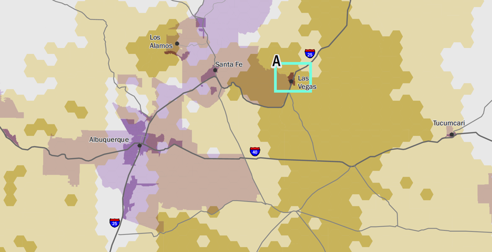
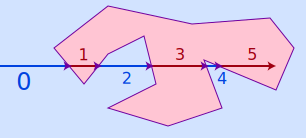
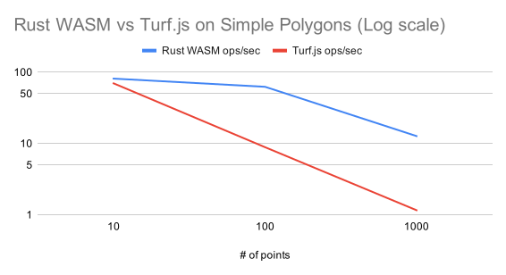
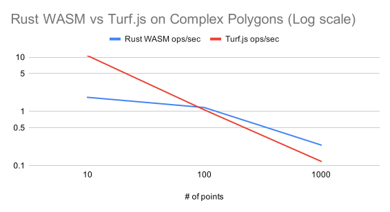
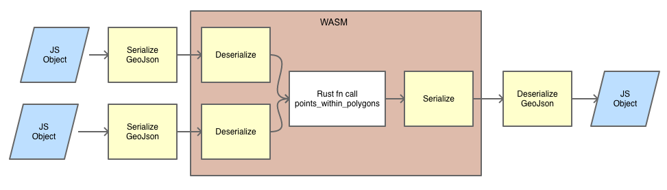

🌵A tour of GIS Spatial Joins, Rust language development, and WebAssembly.

<!-- end -->

[Skip to Benchmarks](#benchmarks)

## Background

I first encountered a very slow spatial join while working on the final project
for my GIS graduate certificate from
[PennState](https://gis.e-education.psu.edu/home). The class was GEOG486:
Cartography and Visualization. I was creating a map of all the lightning strikes
in New Mexico over a 12 year period, aggregated into hex-bins. That's about 10
million points and a thousand hex-bins. Using ESRI ArcMap, the spatial join took
~45 minutes on desktop workstation. I thought "Wow! Why is that so slow?" My
deliverable for that capstone project is a [PDF map, which you can download
here](./Rice_A_Capstone.pdf).



More recently working at [Descartes Labs](https://descarteslabs.com/) we were
developing a JavaScript app for lightweight GIS analysis in browser. One of the
features was a points-in-polygons (PIP) join. It worked fine, but when the
Product Manager tried a data file with complex polygon geometries, the app
grinded to a halt for several minutes. Very slow spatial join strikes again! 👻

Let us dig into this particular type of "contains" spatial join and see why it
can be such a performance hit.

## Visual Explanation


Given a collection of Points, and a collection of Polygons (left), return the
set of Points which are contained by the Polygons (right). It's something you
can do visually without even thinking, but computationally it is more complex
than you might think.

## Ray Cast Algorithm

A common algorithm for deciding whether a point is contained in a polygon is
the raycast algorithm:

 [Melchoir](https://commons.wikimedia.org/wiki/File:RecursiveEvenPolygon.svg) [CC BY-SA 3.0](https://creativecommons.org/licenses/by-sa/3.0)

> One simple way of finding whether the point is inside or outside a simple
> polygon is to test how many times a ray, starting from the point and going in
> any fixed direction, intersects the edges of the polygon. If the point is on
> the outside of the polygon the ray will intersect its edge an even number of
> times. If the point is on the inside of the polygon then it will intersect the
> edge an odd number of times.
> [Wikipedia](https://en.wikipedia.org/wiki/Point_in_polygon)

It should be apparent that this algorithm is sensitive to the complexity of the
polygons. The more edges and holes, the more expensive it is to test each
polygon against each point.

## Learning Rust is a Journey

 [Rust](https://www.rust-lang.org/) is a new programming language from
[Mozilla](https://www.mozilla.org). Rust 1.0 was released in 2015. The 2018
edition of Rust focused on the developer experience and tooling. Rust is being
used for everything from traditional systems programming, to microservices and
network servers, embedded systems, distributed systems, and surprisingly, web
app development too because of it's suitability to target
[WebAssembly](https://webassembly.org/) (WASM).

In the late 90's I attempted to learn C / C++ but never got very far with it,
because I did not have the determination and patience. Simply put, once I
experienced crashing and memory corruption and started to reach for safer
alternatives. I had better luck with Objective-C and it's automatic reference
counting, but even there it was not hard to produce crashing bugs. Instead I
found comfort in Java with it's garbage collected memory management, had some
success with C# as well, plus a variety of scripting languages such as Perl and
Python.

But today Rust *claims* to brings something entirely new: Performance,
Reliability and Productivity. It's borrow checking compiler and lifetimes
annotation is, I believe, something disruptive and innovative. It also takes
ideas from other modern languages, such as OCaml, F#, and Haskell (the ML
language family) as well as C++.

I wanted to try out these lofty claims for myself. I have read some Rust books,
and done some coding exercises, so I decided this would be a good first project:

1. Implement a points-in-polygons (PIP) spatial join in Rust
2. Compile it to WASM
3. Benchmark it's performance compared with a popular JavaScript library

## Dancing With The Borrow Checker

Rust has a significant learning curve. In my experience though, it is not as
tough as C / C++. The beauty of the Rust developer experience is in how the
compiler (rustc), package manager (cargo), and linter (clippy) all combine to
make a consistent environment that is always pushing you forward and helping you
write better code. It is really a joy to use. Yes, sometimes you have to battle
(I prefer to think of it as "dance") with the borrow checker and solve puzzles
about ownership vs references. Sometimes it is maddening. But in the end, once
something compiles, you will have a great degree of confidence that it is going
to do exactly what you expect it to, and do it efficiently.

I intend to show in this article that it is possible for a Rust beginner to:

- Create something that compiles and runs reliably
- Has unit tests
- Runs much faster than a scripting language

## Define The Function Signature

[Turf.js](http://turfjs.org/) is a popular open source package for geospatial
analysis for browsers and Node.js. One of Turf's functions is
[pointsWithinPolygon](http://turfjs.org/docs/#pointsWithinPolygon). Let's call
that the reference implementation. The function signature is:

```typescript
points (Feature|FeatureCollection <Point>) // Points as input search
polygon (FeatureCollection|Geometry|Feature<(Polygon|MultiPolygon)>) // Points must be within these (Multi)Polygon(s)
returns FeatureCollection<Point> //  points that land within at least one polygon
```

For this exercise, I simplified that to:

```typescript
points (FeatureCollection<Point>)
polygons (FeatureCollection<(Polygon|MultiPolygon)>)
returns FeatureCollection<Point>
```

Translated from JavaScript to Rust, the `fn` signature is therefore:

```rust
pub fn points_within_polygons(
    points: FeatureCollection,
    polygons: FeatureCollection,
) -> Option<FeatureCollection>
```

Notice the return type is `Option`. Rust has enumerated types, and in this
example it can return `None` or `Some(FeatureCollection)`. If no points are
matched, it is clear what happens in the Rust code: `None` is returned. Consider
the JavaScript function, what happens if no points are matched? An empty
FeatureCollection is created?

Also notice the Rust types are relaxed on the points and polygons parameters. In
[GeoRust](https://docs.rs/geojson/latest/geojson/) the `FeatureCollection` type
is considered as the serialization format (part of the GeoJson spec). There is
no way I could find to express exactly
`FeatureCollection<(Polygon|MultiPolygon)>` as the Turf.js docs are suggesting.

However, in Rust, we can [pattern
match](https://doc.rust-lang.org/book/ch06-00-enums.html)
the data at runtime and extract only the features we are interested in: Points,
Polygons and MultiPolygons.

## Pick a Data Set

- Points dataset: I randomly generated sets of 10, 100 and 1,000 points in
  decimal degrees and wrote them to files as a GeoJson FeatureCollection. [I
  wrote a tiny Rust program to do that](
  https://github.com/guidorice/random-geojson-points).

- Polygons dataset: I chose the [Natural
  Earth](http://www.naturalearthdata.com/) datasets [`ne_110m_land` and
  `ne_10m_land`](https://www.naturalearthdata.com/downloads/110m-physical-vectors/).
  This was convenient because it comes with multiple levels of simplification
  and many people are familiar with it I chose the 1:110m and 1:10m for this
  exercise. Recall the Visual Explanation above? Those polygons are the Natural
  Earth land vector data:


## Test Driven Development (TDD)

Having identified the reference implementation (Turf.js's `pointsWithinPolygon`
function) and our two inputs to the function, next I wrote a small TypeScript
module to run in Node.js and call Turf.js and print out the results. I saved
these to geojson files into `tests/fixtures/natural-earth/`. Now there are 6
test cases which we will benchmark against later. Simple and Complex polygons,
and 3 sizes of Point collections (10, 100 and 1,000).

```bash
tests/fixtures/natural-earth
├── ne_10m_land.geojson
├── ne_10m_land_points10_result.geojson
├── ne_10m_land_points100_result.geojson
├── ne_10m_land_points1000_result.geojson
├── ne_110m_land.geojson
├── ne_110m_land_points10_result.geojson
├── ne_110m_land_points100_result.geojson
├── ne_110m_land_points1000_result.geojson
├── points-10.geojson
├── points-100.geojson
├── points-1000.geojson
└── README.txt
```

Here is an excerpt of one of the unit tests in Rust. Notice the pattern match at
the end:

```rust
// Excerpt of tests/natural_earth.rs
#[test]
fn natural_earth_test_complex_polygons() {
    let points_data = fs::read_to_string([FIXTURES_PATH, "points-10.geojson"].concat())
        .expect(READ_FILE_FAIL_MSG);
    let points_geojson = points_data.parse::<GeoJson>().unwrap();
    let points_fc = common::feature_collection(points_geojson);

    let polygons_data = fs::read_to_string([FIXTURES_PATH, "ne_10m_land.geojson"].concat())
        .expect(READ_FILE_FAIL_MSG);
    let polygons_geojson = polygons_data.parse::<GeoJson>().unwrap();
    let polygons_fc = common::feature_collection(polygons_geojson);

    let expect_pretty_printed =
        fs::read_to_string([FIXTURES_PATH, "ne_10m_land_points10_result.geojson"].concat())
            .expect(READ_FILE_FAIL_MSG);
    let expect_geojson = expect_pretty_printed.parse::<GeoJson>().unwrap();
    let expect_str = expect_geojson.to_string();

    let maybe_result_fc = points_within_polygons(points_fc, polygons_fc);

    match maybe_result_fc {
        Some(feature_collection) => {
            // features may be returned in different order, so assert on the
            // geojson encoding length. (you can also view the geojsons for
            // comparison)
            let result_str = feature_collection.to_string();
            assert_eq!(expect_str.len(), result_str.len());
        }
        None => panic!("expect result to be FeatureCollection"),
    }
}
```

## Rust Implementation

Of interest is the pattern matching, and converting between GeoJson types and
Geo types. It was a pain point learning how to translate into GeoRust's native
types in and out of GeoJson. However, the heavy lifting of the function
`contains()` was already implemented in GeoRust's `geo` crate, so the task was
mostly translating between types, and enumerating through the
`FeatureCollection`s.

The complete source code is in Github, please see the [Links](#links) section.
The section [Next Steps and Optimizations](#next-steps-and-optimizations) lists 
some outstanding TODO items as well as ideas for optimizing this function.

```rust
// Excerpt of src/lib.rs
pub fn points_within_polygons(
  points_fc: geojson::FeatureCollection,
  polygons_fc: geojson::FeatureCollection,
) -> Option<geojson::FeatureCollection> {
  let polygon_geometries = geometries_with_bounds(polygons_fc);
  let contained_point_features: Vec<_> = points_fc
    .features
    .into_iter()
    .filter(|point_feature| match &point_feature.geometry {
      None => false,
      Some(geojson_geometry) => match &geojson_geometry.value {
        geojson::Value::Point(point_type) => {
          let point_geometry = create_geo_point::<f64>(&point_type);
          let point_is_contained = polygon_geometries.iter().any(|geometry_with_bounds| {
            match &geometry_with_bounds.geometry {
              Geometry::Polygon(polygon) => polygon.contains(&point_geometry),
              Geometry::MultiPolygon(multi_polygon) => multi_polygon.contains(&point_geometry),
              _ => false,
            }
          });
          point_is_contained
        }
        _ => false,
      },
    })
    .collect();

  if contained_point_features.is_empty() {
    None
  } else {
    let result = geojson::FeatureCollection {
      bbox: None,
      features: contained_point_features,
      foreign_members: None,
    };
    Some(result)
  }
}
```

### WASM bindings

Rust's wasm-bindgen and wasm-pack tools were easy to use and just worked.
Here is what I came up with to expose the Rust function to JavaScript:

```rust
// Excerpt of wasm/src/lib.rs
#[wasm_bindgen]
pub fn points_within_polygons(points: JsValue, polygons: JsValue) -> JsValue {
    utils::set_panic_hook();
    let points_geojson: GeoJson = points.into_serde().unwrap();
    let polygons_geojson: GeoJson = polygons.into_serde().unwrap();
    let points_fc = feature_collection(points_geojson);
    let polygons_fc = feature_collection(polygons_geojson);
    let opt_feature_collection = lib_points_within_polygons(points_fc, polygons_fc);
    match opt_feature_collection {
        Some(feature_collection) => JsValue::from_serde(&feature_collection).unwrap(),
        None => JsValue::from_bool(false),
    }
}
```
<div id="benchmarks"></div>

## Benchmark Results

More operations per second (ops/sec) is better!





## Discussion

Two interesting observations:

1. Rust WASM is faster in 5/6 of the benchmarks.

2. Rust WASM function exhibits greater performance, relative to Turf.js, the
   more points it's tasked with. Notice the Y-Axis is Log Scale, and the red and
   blue lines are diverging, not parallel, as the number of points increases.

3. Turf.js was faster for one out of the six benchmarkes: 10 points and Complex
   polygons. I have a theory (untested) that is because of the cost of
   serializing the GeoJson to send it to the WASM module. WASM only knows about
   numbers and byte arrays. Everything else has to be serialized. In fact, for
   each function call, there are 6 geojson serialization steps!

## Serialize All The Things (tm)



As suggested above in the discussion, some use cases might not see any
performance gains with WASM if the cost of serialization is greater than the
benefits gained by doing the computation in WASM.

That said, WASM brings other benefits such as consistent performance, no garbage
collection hiccups, and a fast-loading binary format. Rust of course brings it's
type safety and other benefits.

## Next Steps and Future Optimizations

<div id="next-steps-and-optimizations"></div>

## Links

<div id="links"></div>

https://github.com/guidorice/points-within-polygons

https://github.com/guidorice/random-geojson-points

https://www.rust-lang.org/

https://github.com/georust

https://rustwasm.github.io/wasm-pack/

https://rustwasm.github.io/docs/book/

http://www.naturalearthdata.com/

http://turfjs.org/

https://webassembly.org/
