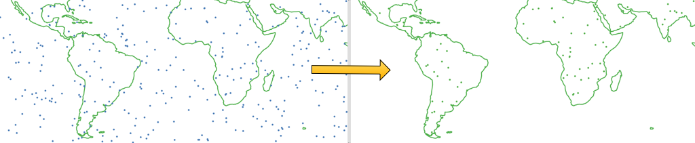

🌵A tour of GIS Spatial Joins, Rust language development, and WebAssembly.

<!-- end -->

## Background

I first encountered a very slow spatial join while working on my capstone project
for my GIS certificate from [PennState](https://gis.e-education.psu.edu/home)
(Geog 486, Cartography and Visualization). In that project I was creating a map
of all the lightning strikes in New Mexico over a 12 year period, aggregated
into hex-bins. That's about 10 million points and a thousand hex-bins.

I was using ESRI ArcMap, and the spatial join took ~45 minutes on a 4-core intel
xeon workstation. I thought- wow why is that so slow? My deliverable for that
capstone project is a [PDF map, which you can download
here](./Rice_A_Capstone.pdf).

screen capture:

Later working at [Descartes Labs](https://descarteslabs.com/) our team was
developing a JavaScript app that was doing some lightweight GIS analysis in
browser. One of the features was a points-in-polygons (PIP) join. It worked OK,
but when the Product Manager tried a data file with complex polygon geometries,
the app grinded to a halt for several minutes. Very slow spatial join again!
👻

## Raycast Algorithm

## Learning Rust

## Benchmark Results

## Next Steps

## Links

